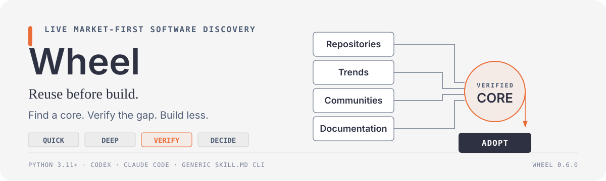
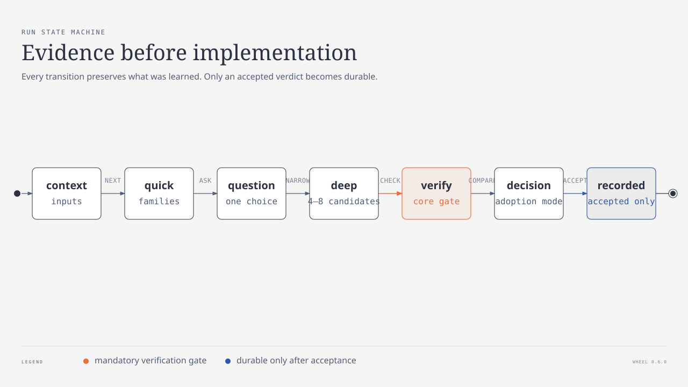

<p align="right">
  <strong>English</strong> · <a href="./README.ru.md">Русский</a>
</p>

<p align="center">
  
</p>

A Claude Code plugin. Before the agent writes code, it looks for something that already does the job, measures how far that thing is from what you asked for, and answers with an adoption mode instead of a diff.

You ask for retries and scheduling. The agent answers that the module you want to extend is a workflow orchestrator, that maintained ones already exist, and that a few questions will show which of them fits your constraints. Then it asks them.

## What it returns

Six modes, ordered by how much of the code you end up owning:

| Mode | What happens | Who owns the code |
| --- | --- | --- |
| `deploy` | install it as it is | upstream |
| `package` | wrap it for your environment | upstream, plus your image or chart |
| `compose` | take one product, add a piece of another | two upstreams, plus your glue |
| `extend-core` | write an extension through its plugin API | upstream, plus your extension |
| `hard-fork` | patch the core, lose the upstream | you, permanently |
| `assemble` | no direct match, build from other people's parts | you, on someone else's design |

There is no seventh mode called *write it from scratch*. When nothing matches, the interview continues until an answer produces a new search, and the result is `assemble`: a dead repository with a good architecture is a free design document and a legal source of code.

The line between `extend-core` and `hard-fork` is the expensive one. The first keeps your right to pull upstream changes, the second ends it. The plugin has to say which one it is proposing and why the change does not fit in a plugin or a hook.

## Two axes, never merged

Maturity answers *can this be relied on*. It is computed from the GitHub API, not from an opinion:

```console
$ node scripts/maturity.mjs kestra-io/kestra n8n-io/n8n oil-oil/beautify-github-readme
A  kestra-io/kestra                ★27812   deploy-gap:none   [alive adopted sustained safe bus]
B  n8n-io/n8n                      ★200711  deploy-gap:small  [alive adopted sustained bus]
A  oil-oil/beautify-github-readme  ★1605    deploy-gap:n/a    [alive adopted safe bus]
```

`n8n` is a `B` because its license is fair-code, not OSI. That is the kind of fact worth learning before adoption rather than after. The third row is a skills repository, which has no releases and nothing to deploy, so it is scored on four flags instead of five.

Gap answers *how much work is left*, and it is a different question:

| Gap | Question | Measured for |
| --- | --- | --- |
| functional | does it do the thing | every candidate |
| operational | does it run where you need it | every candidate, by script |
| architectural | does the change reach into the core | the two finalists only |

Software that is perfect but ships native-only when you need Kubernetes has a zero functional gap and a day of operational work. Judged by maturity alone it looks like *just install it*. Reading the source of six projects to find the architectural gap, when five of them will lose the first question, is the reason that measurement waits for the finalists.

## How the interview works

<p align="center">
  
</p>

Questions are derived from how the candidates actually differ. One rule governs whether a question is asked at all:

> A question is legal only if its answer removes candidates.

If every answer leaves the same repositories standing, the question is about implementation, and implementation is the job of the product you are adopting. What is left looks like this:

```text
❓ Q1 — Weight: a suite with a UI and hundreds of integrations, or an engine without one?

   suite  → n8n, Windmill              (2 candidates)
   engine → Kestra, Prefect, Temporal  (3 candidates)

➡️ Recommended: engine. You already have a frontend; a second UI would duplicate it.
```

Depth runs inverse to the candidate count. Eight candidates need one round because the differences are obvious. One candidate needs three, because the question changes from *which* to *whether*. Zero candidates is where the interview gets long: every detail of an answer becomes another search, in an adjacent field, another language, another name for the same problem.

## Install

```text
/plugin marketplace add kalpakprod/wheel
```

```text
/plugin install wheel@wheel
```

Restart the session afterwards. Plugins are loaded at startup.

## Use

The gate runs by itself through a `SessionStart` hook. To invoke it directly:

```text
/wheel background job orchestration with retries
```

To score a repository without running the pipeline:

```bash
node scripts/maturity.mjs n8n-io/n8n kestra-io/kestra
node scripts/maturity.mjs --json owner/repo     # for scripts
node scripts/maturity.mjs --self-check          # logic only, no network
```

Results are cached in `registry/maturity.json` for seven days. Requires the `gh` CLI, authenticated.

Verdicts worth keeping are written to `~/.claude/wheel/decisions/`, and only when all three conditions hold: the decision is hard to reverse, surprising without context, and the result of a real trade-off. Adopting Kestra over your own orchestrator qualifies. Installing a formatter does not.

## The project catalog

`S3` starts its search in a catalog of projects that people actually talk about, so the first
candidates arrive already parsed: maturity computed, stack and deployment noted, and the search
terms of the niche recorded in both English and Russian.

The catalog ships apart from the plugin, from the releases of
[wheel-catalog](https://github.com/kalpakprod/wheel-catalog), because it is rebuilt daily and
committing it here would make every install download that history. A background check runs at most
once a day from the same `SessionStart` hook, walks the mirrors listed in the manifest, verifies the
archive against its `sha256`, and swaps the file atomically. No network, no catalog, no problem:
the step is skipped in silence.

```bash
WHEEL_NO_UPDATE=1              # or {"autoupdate": false} in ~/.claude/wheel/config.json
scripts/catalog-update.sh      # fetch it right now
scripts/catalog-update.test.sh # five cases against two fake mirrors
```

Judgements of the kind "should I install this" are deliberately absent from the shared catalog:
they depend on what already sits in your stack. If you build your own catalog, put it in
`~/.claude/wheel/catalog.local.jsonl` and it will be read first.

## What it refuses to do

A plugin built against unnecessary code turns into a rewrite generator unless it is held back, because replacing your project always looks profitable: the gain from a mature product is large and visible, and the cost of migration is invisible until measured.

- Replacement is not proposed without numbers: size of your code, volume of your data, count of your integrations.
- Replacement is never shown alone. `extend` sits next to it, with both prices.
- Code older than a year and running in production moves replacement from a recommendation to a note.
- Forward-looking work splits in two. Features already inside the chosen product cost nothing and are offered. Everything else is written down and left unbuilt.

## Built on

A plugin that tells you to adopt existing work has to start with itself.

| What | From | Used for |
| --- | --- | --- |
| interview mechanics | [mattpocock/skills](https://github.com/mattpocock/skills) | design tree, frontier, rounds |
| when a decision is worth recording | same | hard to reverse, surprising, a real trade-off |
| skill installation by stack | [midudev/autoskills](https://github.com/midudev/autoskills) | detect technologies, install matching skills |
| README design system | [oil-oil/beautify-github-readme](https://github.com/oil-oil/beautify-github-readme) | project-native SVG, content order |
| prose rules | [anbeeld/WRITING.md](https://github.com/anbeeld/WRITING.md) | this page |

The original skills are MIT and are forked here as `wheel-grilling` and `wheel-decision`; see [NOTICE](./NOTICE) for what changed.

What remains original: the elimination rule, splitting risk and work into two axes, `registry/capabilities.yaml`, and the maturity script.

## Structure

```text
.claude-plugin/plugin.json    plugin manifest
hooks/session-start.sh        injects the gate into every session
skills/wheel/SKILL.md         the S0–S6 pipeline
skills/wheel-grilling/        the interview
skills/wheel-decision/        the verdict record
commands/wheel.md             /wheel
registry/capabilities.yaml    intent tags, skills, search terms
scripts/maturity.mjs          five maturity flags and the operational gap
scripts/catalog-update.sh     background catalog refresh, mirrors and sha256
```

## License

MIT
